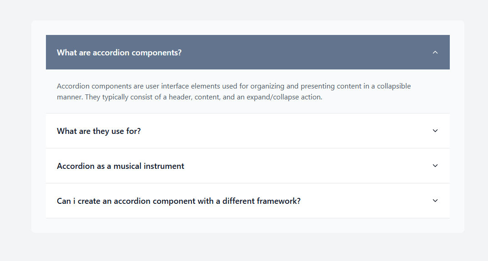

# React Accordion Component with Tailwind CSS

A modern, animated accordion component built with React, Vite, and Tailwind CSS. Features smooth animations, elegant transitions, and a responsive design.



[https://roadmap.sh/projects/accordion](https://roadmap.sh/projects/accordion)

## Features

- 🎯 Smooth expand/collapse animations
- 🔄 Rotating arrow indicators
- 🎨 Dynamic color transitions on hover and active states
- 📱 Fully responsive design
- ⚡ Built with Vite for lightning-fast development
- 🎭 Styled with Tailwind CSS
- 🔍 Clean and minimal design

## Tech Stack

- React
- Vite
- Tailwind CSS
- React Icons

## Getting Started

### Prerequisites

- Node.js (v14.0.0 or higher)
- npm (v6.0.0 or higher)

### Installation

1. Clone the repository:

```bash
git clone https://github.com/yourusername/react-accordion-component.git
```

2. Install dependencies:    

```bash
npm install
```

3. Start the development server:    

```bash
npm run dev
```

4. Open your browser and navigate to `http://localhost:5173` to see the component in action.    

## Usage

1. Import the Accordion component:

```jsx
import Accordion from './components/AccordionComponent/Accordion';
```

2. Use the Accordion component in your application:

```jsx      
<Accordion />
```


